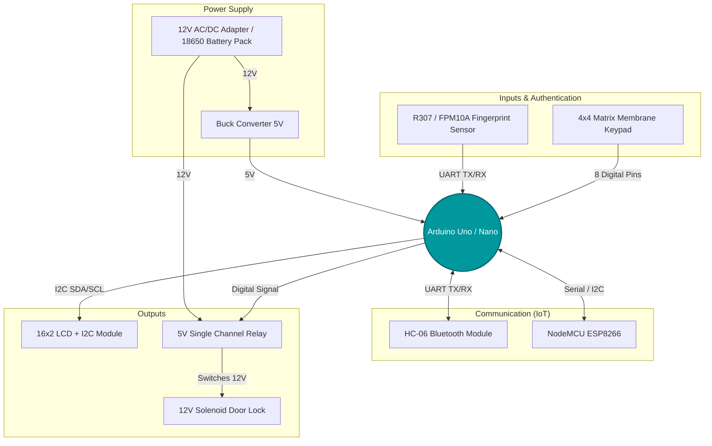

# Smart Biometric & IoT Door Lock System 🚪🔐

A comprehensive Microprocessor and Microcontroller project building a **Smart Door Lock Security System**. This system integrates multiple authentication vectors including biometric fingerprint scanning, a matrix passcode keypad, Bluetooth (HC-06) local control, and WiFi (ESP8266 NodeMCU) remote monitoring. 

## 📋 Table of Contents
- [System Architecture](#-system-architecture)
- [Hardware Components](#-hardware-components)
- [Circuit & Pinout Guide](#-circuit--pinout-guide)
- [Power Distribution](#-power-distribution)
- [Future Code Setup](#-future-code-setup)

---

## 🏗 System Architecture

The architecture relies on an **Arduino Uno/Nano** acting as the central processing unit. It interfaces with input sensors (Fingerprint, Keypad), communication modules (Bluetooth, ESP8266), and output devices (LCD, Relay). The Relay isolates the low-voltage logic from the high-current 12V Solenoid Lock.

---

## 🛠 Hardware Components

This project requires a robust set of electronics, mostly gathered from standard hardware component lists:

### Core & Modules
* **Microcontroller:** Arduino Uno R3 / Arduino Nano V3.0
* **IoT Controller:** NodeMCU ESP8266 (CH340) & ESP-01
* **Bluetooth:** HC-06 Bluetooth Module
* **Biometrics:** JM-101 / R307 / FPM10A Optical Fingerprint Reader
* **Inputs:** 4x4 Matrix Membrane Keypad
* **Display:** 16x2 / 20x4 LCD Display with I2C Backpack
* **Actuation:** 12V Solenoid Electrical Door Lock (Big) + 5V Single Channel Relay Module
* **Secondary Actuation (Optional):** SG90 Servo Motor

### Power & Miscellaneous
* **Power Supply:** 12V 2A AC/DC Power Adapter OR 18650 Li-ion Battery pack (4S configuration)
* **Breadboards:** Large, Medium, and Small
* **Cables:** 100+ Jumper Wires (M-M, M-F, F-F), Female Barrel Jack to Alligator clips

---

## 🔌 Circuit & Pinout Guide

Below is the standard wiring guideline to interface these components with the Arduino Uno/Nano safely.

### 1. Fingerprint Sensor (JM-101 / R307)
*Uses SoftwareSerial to save hardware TX/RX for debugging.*
| Sensor Pin | Arduino Pin | Note |
| :--- | :--- | :--- |
| VCC (Red) | `5V` | Power |
| GND (Black) | `GND` | Ground |
| TX (Yellow) | `D2` | Software RX |
| RX (Green) | `D3` | Software TX |

### 2. 4x4 Matrix Keypad
| Keypad Pin (L to R) | Arduino Pin | Type |
| :--- | :--- | :--- |
| Pin 1 (Row 1) | `D11` | Digital Output |
| Pin 2 (Row 2) | `D10` | Digital Output |
| Pin 3 (Row 3) | `D9` | Digital Output |
| Pin 4 (Row 4) | `D8` | Digital Output |
| Pin 5 (Col 1) | `D7` | Digital Input (Pullup) |
| Pin 6 (Col 2) | `D6` | Digital Input (Pullup) |
| Pin 7 (Col 3) | `D5` | Digital Input (Pullup) |
| Pin 8 (Col 4) | `D4` | Digital Input (Pullup) |

### 3. LCD Display (with I2C)
| I2C Pin | Arduino Pin |
| :--- | :--- |
| VCC | `5V` |
| GND | `GND` |
| SDA | `A4` (or SDA pin) |
| SCL | `A5` (or SCL pin) |

### 4. Relay & Solenoid Lock
⚠️ **CAUTION:** The Solenoid Lock draws heavy current (~1A-2A). **NEVER** power the solenoid directly from the Arduino 5V pin.
| Relay Pin | Connection |
| :--- | :--- |
| VCC | Arduino `5V` |
| GND | Arduino `GND` |
| IN (Signal) | Arduino `D12` |
| **COM** | External `12V` Supply (+) |
| **NO** | Solenoid Lock (+) |
| Solenoid (-) | External `12V` Supply (-) / GND |

### 5. HC-06 Bluetooth Module
| HC-06 Pin | Arduino Pin | Note |
| :--- | :--- | :--- |
| VCC | `5V` | |
| GND | `GND` | |
| TX | `RX (D0)` | (Disconnect when uploading code) |
| RX | `TX (D1)` | Use a voltage divider (5V to 3.3V) |

---

## ⚡ Power Distribution

Proper power distribution is critical to prevent the Arduino from resetting when the Solenoid activates.
1. Connect the **12V 2A Adapter** to the Female Barrel Jack.
2. Route the **12V positive (+) wire** directly to the Relay's `COM` port.
3. Route the **12V negative (-) wire** to the Solenoid's negative wire AND the Arduino's `GND`.
4. Power the Arduino using the remaining 12V via the `VIN` pin (which utilizes the onboard voltage regulator to power the 5V logic).

---

## 🚀 Code Setup

I have added boilerplate Arduino skeleton codes for both the Main Arduino and the NodeMCU WiFi module.

### 1. Main Arduino (`Smart_Door_Lock/Smart_Door_Lock.ino`)
Pre-integrates Fingerprint, Keypad, LCD, Bluetooth, and Relay.
- Install [Arduino IDE](https://www.arduino.cc/en/software).
- Install libraries: `Adafruit Fingerprint Sensor Library`, `Keypad`, `LiquidCrystal I2C`.

### 2. NodeMCU ESP8266 (`NodeMCU_WiFi/NodeMCU_WiFi.ino`)
Hosts a Local Web Server to unlock the door remotely via WiFi.
- Add ESP8266 board to Arduino IDE.
- Update `YOUR_WIFI_SSID` and `YOUR_WIFI_PASSWORD` in the code before uploading.

*Document generated and maintained automatically via Antigravity CI.*
